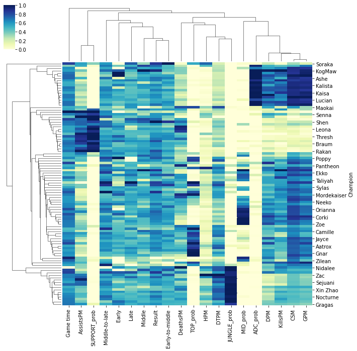
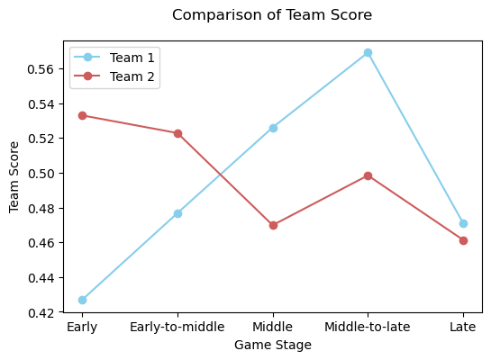

A champions recommender for League of Legends
===========================
This project purposed a League of Legends (LOL) recommender system for champions selection in Python. The main idea is to find out the most appropriate team including five champions of Top, Jungle, Mid, ADC and Support, given a subset of them (like `[ADC: ‘Ashe’, Sup: ‘Yuumi']` >> `[Top: ‘Ornn’, Jun: ‘Lee Sin’, Mid: ‘Kassadin’, ADC: ‘Ashe’, Sup: ‘Yuumi']`). 

Moreover, this recommender consists of a score system based on the strength of champions in different phases for evaluating teams, a similarity evaluation for seeking alternative champions and a counter evaluation for detecting counters for each champion of a team. 

## Version:
* 中文
* English (to be implemented...)

## 目录：

* [0. 写在前面](#0)
* [1. 数据预览](#1)
* [2. 数据处理和计算](#2)
    * [2.1 计算各英雄的平均表现](#2.1)
    * [2.2 计算各英雄被选在某位置的概率](#2.2)
    * [2.3 计算各英雄不同时段胜率](#2.3)
    * [2.4 过滤掉不常见英雄](#2.4)
* [3. 英雄相似度](#3)
* [4. 阵容评分](#4)
* [5. 英雄克制](#5)
* [6. 推荐器](#6)
* [7. 使用方法](#7)

<a id="0"></a>
## 0. 写在前面

作者是一个S3入坑的撸啊撸老玩家，写这篇文章一是是出于老粉的热爱，二是作为一个练手的Python项目。

这个推荐器的目的是为玩家提供参考阵容。首先，我们肯定希望这个阵容的英雄组合是合理且高胜率的。合理性除了满足基本的比赛规则（即英雄不可重复），也在于选取的英雄是否符合该位置，以及英雄搭配是否合理；高胜率在于这个阵容是否经常赢得比赛。这里有一点要提的是，出于竞技游戏的平衡性，大多数英雄包括阵容的总体胜率是趋于0.5的，所以为了更加显著地体现胜率差异，这里考虑加入比赛的时长，旨在得出每个英雄不同游戏阶段的胜率，进而得出每个阵容基于时间段的胜率，而这个胜率相较于前者，在不同阵容之间的差异更加明显，也更有针对性和帮助我们评价阵容。

另一方面，如果仅仅是靠查询，即在过往比赛数据中查找包含给定英雄子集的记录，这样查找的结果肯定是较为有限的，甚至如果给定较多英雄，比如3到4个，意味着条件更加苛刻，最终可能难以找到符合条件的结果。因此，这篇文章引入英雄的相似度分析，目的是为了变相扩充数据集，让推荐器更加灵活。

在给出推荐阵容之后，这个推荐器也给出每个英雄的替代者和counter（克制者）。可替代方案目的在于保证所选英雄作用相当的条件下，为玩家提供更多的选择性，也可以在备选英雄被ban的情况下作为plan B。而出counter的目的在于告诉玩家，哪个英雄是你备选英雄（阵容）最大的威胁，进而可以考虑ban掉该英雄。

**以下仅展示`recommender.py`部分关键代码，全部代码包括爬虫代码请浏览`.py`文件。**

<a id="1"></a>
## 1. 数据预览

这篇文章的数据集是通过爬虫，在[Games of Legend](https://gol.gg/tournament/list/region-ALL/league-1/)获取的赛事数据，因为只是一个小的demo，所以爬取的数据量不多，时间上只覆盖从S8到S10季中赛之前，赛事上只覆盖LPL、LCK、LEC、LCS、MSI和全球总决赛这些顶级赛事，清洗完后仅有22770条数据，也就是2277场比赛。下面给出前十行数据的预览：

|GameID|Game time|Result|Champion|Role|KillsPM|DeathsPM|AssistsPM|CSM|GPM|DPM|HPM|DTPM|
|----|----|----|----|----|----|----|----|----|----|----|----|----|
23705|35.4|WIN|Ornn|TOP|0.028249|0.056497|0.225989|8.2|377|387|166.016949|682.627119|
23705|35.4|WIN|Olaf|JUNGLE|0.056497|0.028249|0.141243|6.0|330|281|441.412429|808.813559|
23705|35.4|WIN|LeBlanc|MID|0.084746|0.000000|0.225989|9.2|413|516|326.666667|567.288136|
23705|35.4|WIN|Miss Fortune|ADC|0.169492|0.028249|0.112994|10.4|474|441|19.067797|253.672316|
23705|35.4|WIN|Yuumi|SUPPORT|0.000000|0.000000|0.282486|0.6|221|215|335.423729|87.146893|
23705|35.4|LOSS|Sett|TOP|0.056497|0.084746|0.028249|9.3|408|353|82.627119|823.418079
23705|35.4|LOSS|Lee Sin|JUNGLE|0.028249|0.084746|0.056497|4.8|280|128|231.723164|684.604520|
23705|35.4|LOSS|Lissandra|MID|0.000000|0.028249|0.084746|8.6|347|440|151.045198|507.853107|
23705|35.4|LOSS|Aphelios|ADC|0.028249|0.084746|0.028249|9.8|402|597|62.598870|351.525424|
23705|35.4|LOSS|Thresh|SUPPORT|0.000000|0.056497|0.056497|0.9|196|75|35.988701|281.412429|

数据的信息可以总结为构成阵容的英雄、他们在游戏中的表现、比赛结果以及时间。以下为解释：

|变量名|解释|
|:----:|----|
|GameID|每场比赛的唯一识别码|
|Game time|比赛时长|
|Result|比赛结果，WIN/LOSS|
|Champion|英雄名称|
|Role|英雄位置，TOP/JUNGLE/MID/ADC/SUPPORT|
|KillsPM|每分钟击杀数|
|DeathsPM|每分钟死亡数|
|AssistsPM|每分钟助攻数|
|CSM|每分钟的补刀数|
|GPM|每分钟的金币数|
|DPM|每分钟的伤害值|
|HPM|每分钟的治疗值|
|DTPM|每分钟的承担伤害值|

<a id="2"></a>
## 2. 数据处理和计算

用于评价英雄相似度的变量除游戏中的表现外，也要考虑是否是同个位置的英雄，以及是否强势时段比较一致，另外还有比较关键的因素如英雄机制和技能的衡量等，在这篇文章中不做考虑。作为衡量数值之间相似度的方法，这里采用的是```pandas```自带的```.corr()```，即Pearson相关系数。最终结果如果某两个英雄分均击杀、死亡、助攻、补刀、金币、伤害、治疗、扛伤、位置、强势时段越为相似，则相似度的值会越趋近于1。

<a id="2.1"></a>
### 2.1 计算各英雄的平均表现

```Python
champion_data = game_data.iloc[:,1:].groupby('Champion').mean()
champion_data.head()
```
|Champion|Game time|Result|KillsPM|DeathsPM|AssistsPM|CSM|GPM|DPM|HPM|DTPM|
|----|----|----|----|----|----|----|----|----|----|----|
|Aatrox|32.453249|0.500000|0.074642|0.076892|0.125133|7.952284|376.769036|360.276650|328.170685|756.168021|
|Ahri|31.317500|0.750000|0.032675|0.006482|0.238946|8.450000|368.250000|365.250000|127.629706|346.269217|
|Akali|33.310619|0.469027|0.108425|0.063172|0.114629|8.439823|388.713864|384.215339|232.132788|564.919651|
|Alistar|32.690299|0.524457|0.022661|0.094076|0.248639|1.607609|256.130435|116.934783|194.338432|450.023260|
|Anivia|30.760000|0.666667|0.035891|0.062490|0.078085|9.066667|366.666667|214.000000|83.425731|490.418586|

<a id="2.2"></a>
### 2.2 计算各英雄被选在某位置的概率

```Python
presence = game_data.groupby('Champion')['GameID'].count()
role_prob = game_data.groupby(['Champion','Role'])[['GameID']].count()
role_prob = role_prob.unstack().fillna(0)
for i in range(5):
    role_prob.iloc[:,i] /= presence
role_prob.columns = [x + '_prob' for x in role_prob.columns.levels[1]]
champion_data = pd.concat([champion_data,role_prob], axis=1)
champion_data.head()
```
|Champion|ADC_prob| JUNGLE_prob|MID_prob|SUPPORT_prob|TOP_prob|
|----|----|----|----|----|----|
|Aatrox|0.0|0.098985|0.083756|0.0|0.817259|
|Ahri|0.0|0.000000|1.000000|0.0|0.000000|
|Akali|0.0|0.000000|0.560472|0.0|0.439528|
|Alistar|0.0|0.000000|0.000000|1.0|0.000000|
|Anivia|0.0|0.000000|1.000000|0.0|0.000000|

<a id="2.3"></a>
### 2.3 计算各英雄不同时段胜率

对于时段的划分，这里参考了[技术控](http://jishukong.com/effect)，少于或等于25分钟为“Early”（前期），大于25分钟、少于或等于30分钟为“Early-to-middle”（前中期），大于30分钟、少于或等于35分钟为“Middle”（中期），大于35分钟、少于或等于40分钟为“Middle-to-late”（中后期），大于40分钟为“late”（后期）。

另外，由于数据量的问题，有些英雄可能在某个时间段没有比赛记录，进而无法计算胜率，因此我们以该时段的平均胜率作为填充。

```Python
def disretize_time(x):
    if x <= 25: return 'Early'
    elif x > 25 and x <=30: return 'Early-to-middle'
    elif x > 30 and x <=35: return 'Middle'
    elif x > 35 and x <=40: return 'Middle-to-late'
    else: return 'Late'
  
game_data['Stage'] = game_data['Game time'].map(disretize_time)
stage_win = game_data.groupby(['Champion','Stage','Result'])[['GameID']].count()
stage_total = stage_win.unstack(level=1).groupby('Champion').sum()
stage_win = stage_win.unstack(level=[1,-1]).iloc[:,[1,3,5,7,9]].fillna(0)
stage_win /= stage_total
stage_win.columns = stage_win.columns.levels[1].tolist()
for col in stage_win:
    stage_win[col] = stage_win[col].fillna(stage_win[col].mean()) # Nan was caused by lack of data, fill it by the average value
Late = stage_win['Late']
stage_win = stage_win.drop('Late', axis=1)
stage_win['Late'] = Late
champion_data = pd.concat([champion_data,stage_win], axis=1)
champion_data.head()
```
|Champion|Early|Early-to-middle|Middle|Middle-to-late|Late|
|----|----|----|----|----|----|
|Aatrox|0.470588|0.495798|0.498141|0.515924|0.506849|
|Ahri|0.460788|1.000000|1.000000|0.000000|0.485682|
|Akali|0.529412|0.382979|0.514286|0.428571|0.586957|
|Alistar|0.600000|0.583333|0.478632|0.475610|0.555556|
|Anivia|0.460788|0.500000|0.480454|1.000000|0.485682|

<a id="2.4"></a>
### 2.4 过滤掉不常见英雄

对于出现次数少于20次的英雄，弃之。过滤并整合后的数据包含100个常见英雄和20个变量。

```Python
ftr_champion_data = champion_data.loc[presence[presence > 20].index] # drop those champions that appeared less than 20 times out
ftr_champion_data.shape
> (100, 20)
```

<p align="center">
  
</p>

<a id="3"></a>
## 3. 英雄相似度

基于Part 2的结果，我们可以直接计算英雄间的相似度。

```Python
ftr_champion_data_corr = ftr_champion_data.T.corr()
def similar_champions(champion, top=5):
    data = pd.DataFrame(ftr_champion_data_corr.loc[champion].sort_values(ascending=False)[1:top+1])
    data.columns=['Similarity']
    return data
```

### 例子
调用`similar_champions`函数，输入`'Sett'`（瑟提），输出与其相似度最高的五个英雄。可以看到有奥恩（Ornn）、克烈（Kled）、波比（Poppy）、赛恩（Sion）和悟空（Wukong）。

```Python
data = similar_champions('Sett')
HTML_show(data)
```

|Champion|Photo|Similarity|
|----|----|----|		
|Ornn||0.999863|
|Kled||0.999015|
|Poppy||0.998412|
|Sion||0.997352|
|Wukong||0.995487|
 
<a id="4"></a>
## 4. 阵容评分

Part 2中得到的不同时段胜率不仅可以用来衡量英雄相似度，也可以用来评价阵容。

```Python
def team_score(team, plot=False):
    win_rate_team = ftr_champion_data.loc[team].iloc[:,-5:]
    if plot:
        plt.figure(dpi=100)
        plt.plot(win_rate_team.mean(), 'bo-', color='IndianRed')
        plt.ylabel('Team Score')
        plt.xlabel('Game Stage')
        plt.title('Team Score of ' + str(win_rate_team.index.tolist()), y=1.05)
        plt.show()
    return win_rate_team

def scores_comparison(team1, team2, plot=True):
    team1_score = team_score(team1, plot=False)
    team2_score = team_score(team2, plot=False)
    if plot:
        plt.figure(dpi=100)
        plt.plot(team1_score.mean(), 'bo-', color='SkyBlue', label='Team 1')
        plt.plot(team2_score.mean(), 'bo-', color='IndianRed', label='Team 2')
        plt.ylabel('Team Score')
        plt.xlabel('Game Stage')
        plt.title('Comparison of Team Score', y=1.05)
        plt.legend()
        plt.show()
    team1_score.insert(0, column='Team', value=['Team 1' for _ in range(5)])
    team2_score.insert(0, column='Team', value=['Team 2' for _ in range(5)])
    output = pd.concat([team1_score, team2_score])
    output = output.reset_index()
    output = output.set_index(['Team','Champion'])
    return output
```

### 例子

调用`scores_comparison`函数，输入`['Ornn', 'Olaf', 'LeBlanc', 'Miss Fortune', 'Yuumi']`，`['Sett', 'Lee Sin', 'Lissandra', 'Aphelios', 'Thresh']`两个阵容进行比较。可以看出第一个阵容在中后期的平均得分要高过第二个阵容，而第二个阵容在前期有比较高的得分。

```Python
team1 = ['Ornn', 'Olaf', 'LeBlanc', 'Miss Fortune', 'Yuumi']
team2 = ['Sett', 'Lee Sin', 'Lissandra', 'Aphelios', 'Thresh']
output = scores_comparison(team1, team2)
HTML_show(output)
```



|Team|Champion|Photo|Early|Early-to-middle|Middle|Middle-to-late|Late|
|----|----|----|----|----|----|----|----|
|Team 1|Ornn||0.500000|0.523256|0.542056|0.578947|0.463415|
|Team 1|Olaf||0.600000|0.531250|0.539568|0.510000|0.439024|
|Team 1|LeBlanc||0.350000|0.506329|0.478632|0.555556|0.600000|
|Team 1|Miss Fortune||0.214286|0.397727|0.545455|0.550725|0.431818|
|Team 1|Yuumi||0.470588|0.425287|0.524390|0.650000|0.421053|
|Team 2|Sett||0.444444|0.433333|0.443038|0.500000|0.407407|
|Team 2|Lee Sin||0.461538|0.485915|0.463277|0.500000|0.493151|
|Team 2|Lissandra||0.608696|0.533333|0.544000|0.574713|0.457143|
|Team 2|Aphelios||0.400000|0.578125|0.479452|0.403846|0.484848|
|Team 2|Thresh||0.750000|0.583333|0.419355|0.513514|0.464286|

<a id="5"></a>
## 5. 英雄克制

英雄的克制率计算为：给定一个英雄，计算其与其他英雄的对抗次数和对抗中输的次数，后者除以前者即可得到克制率。同样，为了保证足够的次数，如果对抗次数少于20次则不给予考虑。

```Python
game_data2 = game_data.set_index('GameID')
def find_counters(champian, top=5):
    loss_gameid = game_data2[(game_data2['Result']==0) & (game_data2['Champion']==champian)].index
    win_gameid = game_data2[(game_data2['Result']==1) & (game_data2['Champion']==champian)].index
    counters = game_data2[game_data2['Result']==1].loc[loss_gameid]
    losers = game_data2[game_data2['Result']==0].loc[win_gameid]
    counters = counters.groupby('Champion')[['Result']].count() # who defeats the given champion
    losers = losers.groupby('Champion')[['Result']].count() # who is defeated by the given champion
    total = counters.merge(losers, how='left', left_index=True, right_index=True).sum(axis=1)
    ftr = total[total > 20].index
    counters /= pd.DataFrame(total, columns=['Result'])
    top_counters = counters.loc[ftr].sort_values(by='Result', ascending=False)[:top]
    top_counters.columns = ['Counter Rate']
    return top_counters
```

### 例子

调用`find_counters`函数，输入`'Sett'`（瑟提），输出与对其最为克制的五个英雄。可以看到有特朗德尔（Trundle）、乐芙兰（LeBlanc）、塔里克（Taric）、韦鲁斯（Varus）和嘉文四世（Jarvan IV），其中最高的克制率为0.8，即在过去瑟提和特朗德尔的比赛中，特朗德尔赢下八成的比赛。

```Python
counters = find_counters('Sett')
HTML_show(counters)
```

|Champion|Photo|Counter Rate|
|----|----|----|
|Trundle||0.800000|
|LeBlanc||0.760000|
|Taric||0.652174|
|Varus||0.644444|
|Jarvan IV||0.59090|

<a id="6"></a>
## 6. 推荐器

基于Part 4 其实我们已经能够搭建一个初步的推荐器了。推荐器的算法如下；

```
1. 输入一个子集，包含少于5个英雄及其位置，和评分的方式包括: Early score, Early-to-middle score, Middle score, Middle-to-late score or Late score.
2. 如果子集为空，则返回过往比赛中得分最高的前N个阵容。
3. 如果子集不为空，则计算子集中每个英雄的前5个相似英雄，将给定位置的英雄扩充至6个。
4. 对给定位置的英雄进行组合。
5. 对于每一项组合，找到过去比赛中包含其的完整阵容，最终形成一个包含多个阵容的列表。
6. 在列表中，将给定位置上的英雄替换回原先给定的英雄。
7. 对列表中的所有阵容进行评分，并排序。
8. 输出得分最高的前N个阵容。
```

这样做的目的在于变相扩充数据集。比如说我们给定ADC是Ashe，SUPPORT是Yummi，而Ashe的相似英雄有Caitlyn，Yummi的相似英雄有Sona，那我们查找的不单是过去包括ADC为Ashe和SUPPORT为Yummi的阵容，还允许ADC为Ashe，SUPPORT为Sona的阵容，或者ADC为Caitlyn，SUPPORT为Sona的阵容...因为他们相似度高，所以我们设想他们在队伍中的作用是等价的，换句话讲，以相似度高的英雄进行替换，对原有的阵容影响不大，这样一来我们可参考的阵容就变得更多了，同时又能一定程度上保证英雄的搭配。

```Python
def recommender(top=False, jun=False, mid=False, adc=False, sup=False, num=1, expect_stage='Middle'):
    dic = {'TOP':top, 'JUNGLE':jun, 'MID':mid, 'ADC':adc, 'SUPPORT':sup}
    if all([x != 0 for x in dic.values()]):
        print('Error: the number of input champions should be less than 5.')
        return
    elif any(dic.values()):
        table = [] # store the most similar champions for each given champion
        roles = [] # store the roles of given champions
        for key, value in dic.items():
            if value:
                similars = similar_champions(value, top=5).index.tolist()
                table.append([value] + similars)
                roles.append(key)
        teams = pd.DataFrame(list(product(*table)), columns=roles) # all possible teams
        teams = teams[teams.apply(lambda x: sum(x.duplicated())==0, axis=1)] # drop if there are duplicated champions in a team
        recmd_teams = pd.merge(all_teams, teams) # find the historical teams
        for col in roles:
            recmd_teams[col] = dic[col]
    else:
        recmd_teams = all_teams.copy()
    # give scores
    col_name = expect_stage + ' Score'
    recmd_teams[col_name] = recmd_teams.apply(lambda x: team_score(x).mean()[[expect_stage]], axis=1)
    recmd_teams = recmd_teams.drop_duplicates()
    return recmd_teams.sort_values(by=col_name, ascending=False)[:num].reset_index(drop=True)
```

### 例子

调用`recommender`函数，输入`adc='Ashe'`，`sup='Yuumi'`, `num=3`,输出基于中期平均胜率（默认）的三个推荐阵容。

```Python
top=False
jun=False
mid=False
adc='Ashe'
sup='Yuumi'
recom_team = recommender(top,jun,mid,adc,sup,num=3)
HTML_show2(recom_team)
```

|TOP|JUNGLE|MID|ADC|SUPPORT|Middle Score|Photo|
|----|----|----|----|----|----|----|
|Ornn|Lee Sin|Kassadin|Ashe|Yuumi|0.567791|<br><br>|
|Kled|Jarvan IV|Corki|Ashe|Yuumi|0.547773|<br><br>|
|Mordekaiser|Jarvan IV|Syndra|Ashe|Yuumi|0.544987|<br><br>|

最后，我们整合前面的部分，得出一个终极版的推荐器。

```Python
def merged_recommender(top=False, jun=False, mid=False, adc=False, sup=False, 
                       num_team=1, num_similar=3, num_counter=1, expect_stage='Middle'):
    team = recommender(top, jun, mid, adc, sup, num_team, expect_stage)
    copy = team.copy()
    copy = copy.set_index(team.columns[-1])
    copy = copy.stack().to_frame()
    copy.columns = ['Champion']

    similar_champs = list(map(lambda x: similar_champions(x,top=num_similar).index.tolist(), copy.iloc[:,0].tolist()))
    similarrate = list(map(lambda x: similar_champions(x,top=num_similar).values.ravel().tolist(), copy.iloc[:,0].tolist()))
    similarrate = [[round(y, 3) for y in x] for x in similarrate]
    copy['Top Similars & Similarity'] =  [list(zip(similar_champs[i],similarrate[i])) for i in range(len(similar_champs))]
    
    counters = list(map(lambda x: find_counters(x,top=num_counter).index.tolist(), copy.iloc[:,0].tolist()))
    counterrate = list(map(lambda x: find_counters(x,top=num_counter).values.ravel().tolist(), copy.iloc[:,0].tolist()))
    counterrate = [[round(y, 3) for y in x] for x in counterrate]
    copy['Top Counters & Counter Rate'] = [list(zip(counters[i],counterrate[i])) for i in range(len(counters))]
    return copy
```

<a id="7"></a>
## 7. 使用方法

直接运行`recommender.py`文件，按照提示输入即可使用。

### 例子

1. 假如当前的阵容为：Sett（TOP），Ashe（ADC），其他英雄待选。推荐阵容数量为3，相似英雄数量为3，counters数量为2，评价方式为`Early-to-middle`。

```
$ python recommender.py
All champions in the data set...

['Aatrox', 'Akali', 'Alistar', 'Aphelios', 'Ashe', 'Azir', 'Bard', 'Blitzcrank', 'Braum', 'Caitlyn', 'Camille', 'Cassiopeia', 'Corki', 'Draven', 'Ekko', 'Elise', 'Ezreal', 'Fiora', 'Galio', 'Gangplank', 'Gnar', 'Gragas', 'Hecarim', 'Irelia', 'Jarvan IV', 'Jax', 'Jayce', 'Jinx', 'Kaisa', 'Kalista', 'Karma', 'Karthus', 'Kassadin', 'Kayle', 'Kennen', 'KhaZix', 'Kindred', 'Kled', 'KogMaw', 'LeBlanc', 'Lee Sin', 'Leona', 'Lissandra', 'Lucian', 'Lulu', 'Lux', 'Maokai', 'Miss Fortune', 'Mordekaiser', 'Morgana', 'Nautilus', 'Neeko', 'Nidalee', 'Nocturne', 'Olaf', 'Orianna', 'Ornn', 'Pantheon', 'Poppy', 'Pyke', 'Qiyana', 'Rakan', 'RekSai', 'Renekton', 'Riven', 'Rumble', 'Ryze', 'Sejuani', 'Senna', 'Sett', 'Shen', 'Sion', 'Sivir', 'Skarner', 'Sona', 'Soraka', 'Sylas', 'Syndra', 'Tahm Kench', 'Taliyah', 'Taric', 'Thresh', 'Tristana', 'Trundle', 'Urgot', 'Varus', 'Vayne', 'VelKoz', 'Viktor', 'Vladimir', 'Volibear', 'Wukong', 'Xayah', 'Xin Zhao', 'Yasuo', 'Yorick', 'Yuumi', 'Zac', 'Zilean', 'Zoe']

At least input one champion...
```
2. 输入`Sett`作为TOP位置的英雄...
```
TOP Champion (null if skip): Sett
```
3. 回车跳过...
```
JUNGLE Champion (null if skip):
```
4. 回车跳过...
```
MID Champion (null if skip): Ashe
```
5. 输入`Ashe`作为ADC位置的英雄...
```
ADC Champion (null if skip): Ashe
```
6. 回车跳过...
```
SUPPORT Champion (null if skip): 
```
7. 输入`3`作为推荐阵容数量...
```
The expected number of teams to be recommended (1 if skip): 3
```
8. 输入`3`作为相似英雄数量...
```
The number of similars (1 if skip): 3
```
9. 输入`2`作为counter英雄数量...
```
The number of counters (1 if skip): 2
```
10. 输入`Early-to-middle`作为评价方式...
```
The phase (one of Early, Early-to-middle, Middle, Middle-to-late, Late) you concern for win (Middle if skip): Early-to-middle
```
11. 输出...
```
                              Champion                                    Top Similars & Similarity              Top Counters & Counter Rate
Early-to-middle Score                                                                                                                       
0.541377              TOP      Sett     [(Ornn, 1.0), (Kled, 0.999), (Poppy, 0.998)]                 [(Trundle, 0.8), (LeBlanc, 0.76)]      
                      JUNGLE   Olaf     [(Hecarim, 0.997), (Nocturne, 0.997), (KhaZix, 0.995)]       [(Elise, 0.636), (LeBlanc, 0.619)]     
                      MID      Ryze     [(Kennen, 0.999), (Neeko, 0.999), (Lissandra, 0.998)]        [(Alistar, 0.759), (Gragas, 0.688)]    
                      ADC      Ashe     [(Caitlyn, 1.0), (Sivir, 0.999), (Jinx, 0.999)]              [(Sylas, 0.762), (RekSai, 0.714)]      
                      SUPPORT  Alistar  [(Tahm Kench, 0.998), (Skarner, 0.996), (Jarvan IV, 0.993)]  [(Rakan, 0.675), (Lissandra, 0.603)]   
0.540333              TOP      Sett     [(Ornn, 1.0), (Kled, 0.999), (Poppy, 0.998)]                 [(Trundle, 0.8), (LeBlanc, 0.76)]      
                      JUNGLE   Olaf     [(Hecarim, 0.997), (Nocturne, 0.997), (KhaZix, 0.995)]       [(Elise, 0.636), (LeBlanc, 0.619)]     
                      MID      Syndra   [(Caitlyn, 0.999), (VelKoz, 0.998), (KogMaw, 0.998)]         [(LeBlanc, 0.708), (Ryze, 0.63)]       
                      ADC      Ashe     [(Caitlyn, 1.0), (Sivir, 0.999), (Jinx, 0.999)]              [(Sylas, 0.762), (RekSai, 0.714)]      
                      SUPPORT  Thresh   [(Nautilus, 0.996), (Blitzcrank, 0.995), (Shen, 0.994)]      [(Tahm Kench, 0.661), (Sejuani, 0.645)]
0.538972              TOP      Sett     [(Ornn, 1.0), (Kled, 0.999), (Poppy, 0.998)]                 [(Trundle, 0.8), (LeBlanc, 0.76)]      
                      JUNGLE   Olaf     [(Hecarim, 0.997), (Nocturne, 0.997), (KhaZix, 0.995)]       [(Elise, 0.636), (LeBlanc, 0.619)]     
                      MID      Azir     [(Corki, 0.999), (Orianna, 0.999), (Jayce, 0.998)]           [(Taric, 0.655), (Rakan, 0.652)]       
                      ADC      Ashe     [(Caitlyn, 1.0), (Sivir, 0.999), (Jinx, 0.999)]              [(Sylas, 0.762), (RekSai, 0.714)]      
                      SUPPORT  Thresh   [(Nautilus, 0.996), (Blitzcrank, 0.995), (Shen, 0.994)]      [(Tahm Kench, 0.661), (Sejuani, 0.645)]
```

12. 解读：按照`Early-to-middle`的评价标准，即阵容前中期的评分，输出的阵容依次为`[TOP: Sett, JUNGLE: Olaf, MID: Ryze, ADC: Ashe, SUPPORT: Alistar]`，`[TOP: Sett, JUNGLE: Olaf, MID: Syndra, ADC: Ashe, SUPPORT: Thresh]`，`[TOP: Sett, JUNGLE: Olaf, MID: Azir, ADC: Ashe, SUPPORT: Thresh]`，其对应的评分分别为`0.541377`，`0.540333`，`0.538972`。其次，展示在每个英雄之后的有相似者和克制者。例如`Sett`的最相似的是`Ornn`，相似度为`1`，其次是`Kled`，相似度为`0.999`...`Sett`的最佳克制者为`Trundle`，克制率为`0.8`，其次为`LeBlanc`，克制率为`0.76`...其他英雄以此类推。